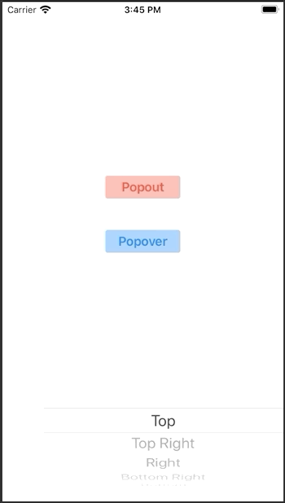

# DYPopoverView

[](https://cocoapods.org/pods/DYPopoverView)
[](https://cocoapods.org/pods/DYPopoverView)
[](https://cocoapods.org/pods/DYPopoverView)


DYPopoverView is a simple SwiftUI accessory popover view for iOS and iPadOS. Works on iOS / iPadOS 13 or later. 

## Example project

This repo only contains the Swift package, no example code. Please download the example project [here](https://github.com/DominikButz/DYPopoverViewExample.git).
You need to add the DYPopoverView package either through cocoapods or the Swift Package Manager (see below - Installation). 

## Features

* 8 positions with automatically adapting arrow position
* set as popout or popover
* Customize the following settings:
	- animation
	- offset
	- differentArrowPosition
	- arrowLength
	- cornerRadius

	Check out the examples for details. 


## Installation


Installation through the Swift Package Manager (SPM) or cocoapods is recommended. 

SPM:
Select your project (not the target) and then select the Swift Packages tab. Click + and type DYPopoverView - SPM should find the package on github. 

Cocoapods:

platform :ios, '13.0'

target '[project name]' do
 	pod 'DYPopoverView'
end


Check out the version history below for the current version.


Make sure to import DYPopoverView in every file where you use DYPopoverView. 

```Swift
    import DYPopoverView
```

## Usage

Check out the following example. This repo only contains the Swift package, no example code. Please download the example project [here](https://github.com/DominikButz/DYPopoverViewExample.git).


 


### Code example: Content View (your main view)


DYPopoverView needs to be attached to another view by adding the anchor modifier to it including a view id. This anchor view can be several levels below the view that you apply the popoverView-modifier to. 
See the following example for details.

```Swift

    import DYPopoverView
    
    struct ContentView: View {
        
        @State var showSecondPopover = false
        @State var showFirstPopover  = false
        @State var secondPopoverFrame = CGRect(x: 0, y: 0, width: UIScreen.main.bounds.width * 0.75, height:150 )

        @State var viewId: String = ""
        @State var popoverPosition: ViewPosition = .bottom
        
        var body: some View {
            NavigationView {
                GeometryReader {  proxy in
                    VStack(alignment: .center) {
               
                    Spacer()
                  
                    Button(action: {

                        self.showFirstPopover.toggle()
                           
                       }) {
                           TranslucentTextButtonView(title: "Popout", foregroundColor: .red, backgroundColor: .red, frameWidth: 100)
                        }.anchorView(viewId:"0").padding()
                           
                    
          
                        Button(action: {
                           // self.viewId = "1"
                            self.showSecondPopover.toggle()
                          }) {
                              TranslucentTextButtonView(title: "Popover", foregroundColor: .accentColor, backgroundColor: .accentColor, frameWidth: 100)
                              
                        }
                        .anchorView(viewId:"1").padding()
            
               
                    
                        Spacer()
                    
                        Picker("", selection: self.$popoverPosition) {
                            ForEach(0 ..< ViewPosition.allCases.count) {
                                Text(ViewPosition.allCases[$0].rawValue).tag(ViewPosition.allCases[$0])
                            }
                        }
                        
                    
                    
                    
                }.frame(width: proxy.size.width).background(Color(.systemBackground))
                .popoverView(content: {Text("Content")}, background: {BlurView(style: .systemChromeMaterial)}, isPresented: self.$showFirstPopover, frame: .constant(CGRect(x: 0, y: 0, width: 150, height: 150)), popoverType: .popout, position: self.popoverPosition, viewId: "0", settings: DYPopoverViewSettings(shadowRadius: 20))
                .popoverView(content: {ContentExample(frame: self.$secondPopoverFrame, show:self.$showSecondPopover)}, background: {Color(.secondarySystemBackground)}, isPresented: self.$showSecondPopover, frame: self.$secondPopoverFrame, popoverType: .popover, position: self.popoverPosition, viewId: "1", settings: DYPopoverViewSettings(cornerRadius: (30, 30, 30, 30)))

             }
            }
        }

    }
   

```


## Change log

#### [Version 1.0](https://github.com/DominikButz/DYPopoverView/releases/tag/1.0)
 Initializer changed - added background. Removed backgroundColor from settings. 

#### [Version 0.2](https://github.com/DominikButz/DYPopoverView/releases/tag/0.2)
 Initializer changed - the content view needs to be put in a closure instead of casting it to AnyView.
 
#### [Version 0.1](https://github.com/DominikButz/DYPopoverView/releases/tag/0.1)

Initial public release. 


## Author

dominikbutz@gmail.com

## License

DYPopoverView is available under the MIT license. See the LICENSE file for more info.

